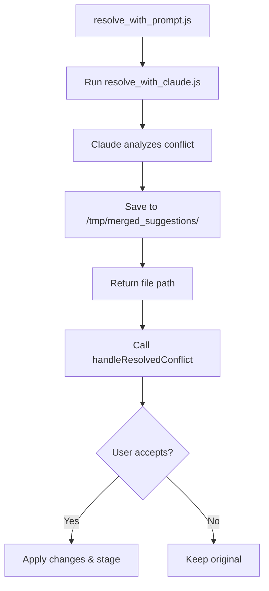

# Integration Guide: Claude Resolution + CLI Prompt

## Overview

The integration connects two components:
1. **`resolve_with_claude.js`** - Gets AI resolution from Claude
2. **`cli_resolution_handler.js`** - Handles user confirmation and file application

The wrapper script **`resolve_with_prompt.js`** connects these pieces without modifying either.

## File Structure
```
bin/
├── resolve_with_claude.js      # Original: Calls Claude API
├── cli_resolution_handler.js   # Original: Handles user prompts
└── resolve_with_prompt.js      # NEW: Wrapper that connects them
```

## How It Works



## Usage

### Basic Usage
```bash
# Auto-detect first conflicted file
node bin/resolve_with_prompt.js

# Specify a file
node bin/resolve_with_prompt.js --file src/auth.py
```

### Environment Variables
```bash
# Required
export ANTHROPIC_API_KEY=your_key_here

# Optional
export MERGE_OUTPUT_ROOT=/custom/path  # Default: /tmp/merged_suggestions
export MODEL=claude-3-5-sonnet-20241022  # Default model
```

## Integration Steps

### Step 1: Claude Resolution
- Runs `resolve_with_claude.js` as subprocess
- Captures the output file path from console
- Shows Claude's analysis to user

### Step 2: User Prompt
- Calls `handleResolvedConflict()` with:
  - Path to Claude's resolution file
  - Path to original conflicted file
- Shows options to view/accept/reject

### Step 3: Apply Changes
- If accepted: overwrites file, stages in git
- If rejected: keeps original, resolution saved for reference
- Cleans up temp files

## Testing

```bash
# Run the test script
chmod +x test_claude_merge_resolution.sh
./test_claude_merge_resolution.sh

# This will:
# 1. Create a test repo with conflict
# 2. Run the full resolution flow
# 3. Show the results
```

## Key Functions

### resolve_with_prompt.js
```javascript
runClaudeResolution(targetFile)  // Runs Claude, returns output path
main()                           // Orchestrates the full flow
```

### From cli_resolution_handler.js
```javascript
handleResolvedConflict(tempFilePath, conflictFilePath)  // Main handler
applyResolution()                                        // Applies changes
cleanupTempFile()                                       // Cleanup
```

## Error Handling

- ✅ Missing API key → Clear error message
- ✅ No conflicts → Tells user no conflicts found
- ✅ Claude fails → Shows error, exits gracefully
- ✅ User rejects → Keeps original, saves suggestion

## Next Steps for merj pull Integration

In your main `merj pull` command, after detecting conflicts:

```javascript
// After your RAG and CodeRabbit analysis...
const { spawn } = require('child_process');

// Run the integrated resolution
const resolveProcess = spawn('node', [
  'bin/resolve_with_prompt.js',
  '--file', conflictedFile
]);

resolveProcess.on('close', (code) => {
  if (code === 0) {
    console.log('✅ Conflict resolved!');
  } else {
    console.log('❌ Manual resolution needed');
  }
});
```

## Benefits of This Approach

1. **No modifications** to working components
2. **Clean separation** of concerns
3. **Easy to test** each piece independently
4. **Simple integration** into merj pull
5. **Clear error handling** at each step